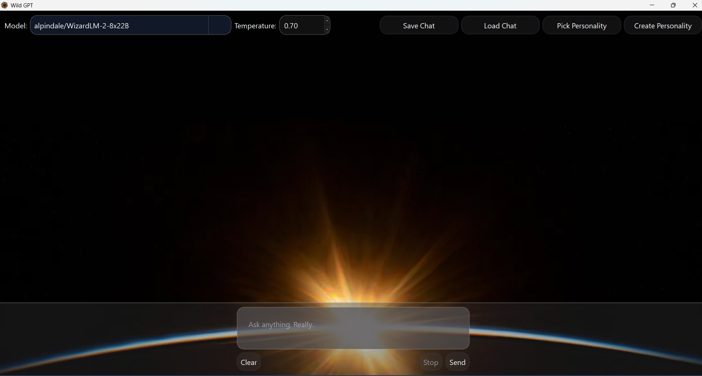

# 🐾 WildGPT

WildGPT is a desktop chat interface for talking to open large language models — the kind you can find on [Hugging Face](https://huggingface.co/).  
It’s written in **Python** with **PyQt5**, built to feel fast, responsive, and a little more *real* than most polished corporate AI apps.

Unlike ChatGPT, WildGPT doesn't have strict guardrails. It does depend on which model you select, but the guardrails are far less than on OpenAI, allowing adults a more free experience.

---

## ✨ What Makes It Cool
- 🧠 **Pick your own brain:** connect to different Hugging Face LLMs straight from the app.  
- 💬 **Custom personalities:** define how your AI should behave — poetic, sarcastic, stoic, flirty, teacherly, whatever you like.  
- 🎨 **Clean PyQt5 UI:** scrollable, fluid chat bubbles that resize to the text.  
- ⚙️ **Thread-safe and responsive:** no frozen windows, no weird lag — the app handles background requests gracefully.  
- 🪶 **Lightweight:** no server-side nonsense. It’s all local logic with API calls to the model host.  

---

## 🧩 The Interface


Each message bubble adapts to its text length and supports scrolling inside long replies.  
The layout is fully dynamic — it feels natural, not boxed-in.

---

## ⚙️ How to Run It
You’ll need **Python 3.10+** and at a minimum 1 Hugging Face API key. This repo is hooked up to talk to featherless AI LLMs. I paid for access to an API key from Featherless AI, but I use huggingface API to speak to featherless AI as an inference provider. In order to get setup, you can create a .env file at the root of the repo. Specify the variable HF_TOKEN. Alternatively, you can login to huggingface using hf auth login. I had to make an account on huggingface, get a token from them (its free), and configure my settings to use my featherless ai token (look under provider settings). Please reference the API documentation if you intend to run this repo using python. A more user friendly version is coming but will take time to develop!

If you don't care about featherless AI, then you can make some simple changes to the code to speak to any huggingface model. Check the stream_worker.py file. If you do that, setup is a bit simpler, just provide the free huggingface token. Just be aware that they only give you a tiny bit of free usage. It is fun just to try out.

Setup your repo like this:

```bash
git clone https://github.com/FibonacciSpiral/WildGPT.git
cd WildGPT
pip install -r requirements.txt
python main.py
